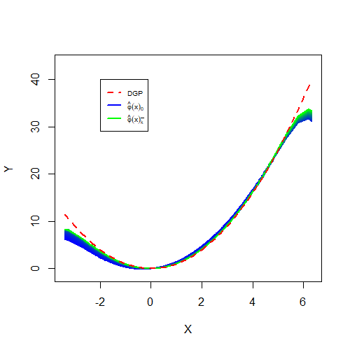
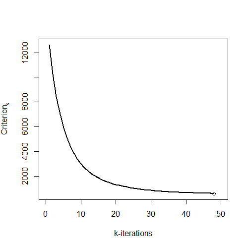
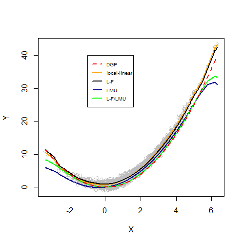
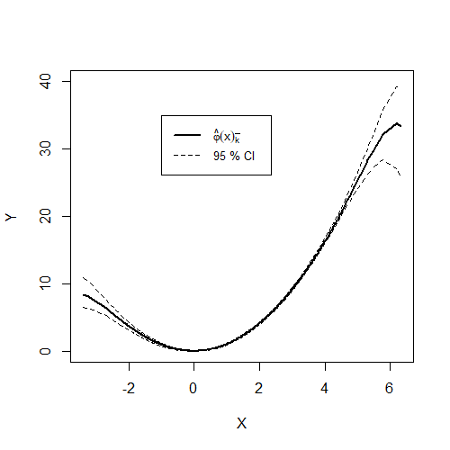

# Replication notebook for

[Nonparametric instrumental regression with two-way fixed effects](https://www.degruyter.com/document/doi/10.1515/jem-2022-0025/html), 2023, *Journal of Econometric Methods*. 

## Package download  

Download the file [npivfe](Code_npivfe/npivfe.zip) containing an `R` file with all functions needed to apply the approach described in the paper as well as a *readme* file providing a description of the functions.   

## Model description 

Below we generate data of the two-way fixed effects panel model, given
by 
$$ Y_{it} = \varphi(X_{it}) + \xi_i + \delta_t + U_{it},$$ 
where $X_{it}$ denotes the endogenous dependent variable that is correlated with both the unobserved individual and temporal fixed effects, $\xi_i$ and $\delta_t$, and with the error term $U_{it}$. Further, we generate a valid instrument $Z_{it}$, satisfying 
$$
E(U_{it} | Z_{it}) = 0 \hspace{4mm} \text{and} \hspace{4mm} cor(X_{it},Z_{it}) \neq 0.  
$$ 
Note that to stay consistent with the variable convention used in the
code, the notation used here changes slightly w.r.t. the one presented
in paper. More precisely, while in the paper $Z_{it}$ and $W_{it}$
denote the explanatory and the instrumental variable, in the code these
variables refer to `x` and `z`, respectively.

## Data generating process 
```{r}
#| warning: false

library(knitr)
library(latex2exp)

set.seed(49)

# Generate panel structure 
N = 100  
T = 20   
NT = N*T
iota_T = rep(1, T)
iota_N = rep(1, N)
trend_T = c(1:T)
ind_N = c(1:N)
col_T = iota_N %x% trend_T 
col_N = ind_N %x% iota_T 

# Parts of the DGP in Racine (2019, p. 288) 
# Correlation parameters 
rho.xz = 0.2  
rho.ux = 0.8
sigma.u = 0.05

# DGP of the quadratic model 
dgp = function(x){x^2}

# Generate endogeneity in x 
v1 = rnorm(NT, 0, 0.8)
v2 = rnorm(NT, 0, 0.15)
eps = rnorm(NT, 0, sigma.u)
u = rho.ux*v1 + eps 

# Individual fixed effects
xi_i = runif(N, 0, 1.5)
xi_i = as.matrix( xi_i %x% iota_T )

# Time fixed effects 
delta_t = runif(T, 0, 1.7)
delta_t = as.matrix( rep( delta_t, N ) )

# Explanatory variable needs to be correlated with
# the error term as well as with the
# individual and temporal effects

# Generate "auxiliary" explanatory variable
x = matrix( NT, nrow = NT, ncol = 1 )

# Correlation with individual and temporal effects
for(i in 1:NT){
  x[i,1] = rnorm( 1, mean = (xi_i[i] + delta_t[i]), sd = 1 ) 
}

# Auxiliary variable used to introduce correlation 
# between the instrument and the explanatory variable
z = rho.xz*x + v2

# Generate explanatory variable also correlated
# with error term (i.e. E(u*x) != 0)
x = x + v1

# Dependent variable 
y = as.matrix( dgp(x=x) ) + xi_i + delta_t + u 

# Plot the data points along with the true DGP
plot( x, y,
      pch = 21, 
      col = "grey", 
      ylab = "Y", 
      xlab = "X" ,
      main = "")
curve( dgp(x),
       col="red", 
       add=TRUE, 
       lty = 2, 
       lwd = 2)
legend( -2, 40, 
        legend = c("DGP", "Observations"), 
        col = c("red", "grey"),
        lty = c(2, 1),
        lwd = c(2, 2),
        cex = 0.8)

# Covariance matrix 
covmat = round( cov( cbind( x, z, xi_i, delta_t, u ) ), 2)
colnames( covmat ) <- rownames( covmat ) <- c( "$x_{it}$", "$z_{it}$", "$\\xi_i$", "$\\delta_t$", "$u_{it}$" )
covmat[ lower.tri( covmat, diag = TRUE ) ] =  ""
kable( covmat, 
       caption = "Covariance matrix of observables and unobservables" )

```

To further investigate the data you might assemble the observable variables with the individual and time identifiers: 

````{r}
Data = data.frame( cbind( col_N, col_T, y, x, z ) )
colnames( Data ) <- c( "col_N", "col_T", "y", "x", "z" )
````

## Estimation 

Load the functions needed for the nonparametric instrumental estimator with two-way fixed effects. (Download above the file `npivfe.R` containing the functions.)
````{r, eval=FALSE }
source(".../npivfe.R")
````
Use the function `npregivfe` provided in the package to estimate the conditional mean function $\varphi$. 

Note that the estimation routine is very time intensive as it involves several numerical optimizations to obtain optimal bandwidths as well as several iterations of the Landweber-Fridman regularization procedure. However, I'm sure that the way I coded the estimator can be improved significantly to reduce the run time. 
````{r, eval=FALSE }
res.npivfe = npregivfe( y = y,
                        x = x,
                        z = z, 
                        c = 0.5,  
                        tol = 1,   
                        N = N,
                        T = T, 
                        max.iter = 100,
                        bw_method = "optimal",
                        effects = "indiv-time",
                        type = "ll" )

````
Investigate the regularized solution path:
````{r, eval=FALSE }
library(latex2exp)
library(colorRamps)
# (NT x K) matrix, with K the total number of iterations
# within the Landweber-Fridman estimation procedure. 
phi_k_mat = res.npivfe[[1]]

# Total number of iterations
k_bar = ncol( phi_k_mat ) 

# Final point-wise estimates of the function of interest
fit.npivfe = phi_k_mat[, k_bar]  

# Plot the initial guess phi_0
plot( x[order(x)], phi_k_mat[, 1][order(x)],
      col = blue2green(k_bar)[1],
      type = "l",
      lwd = 2,
      ylim = range(y),
      ylab = "Y", xlab = "X", main = "" ) 

# Plot all successive estimates phi_k, k=1,...,k_bar
for(k in 1:k_bar){
  lines( x[order(x)], phi_k_mat[, k][order(x)], 
         type = "l",
         lwd = 2, 
         col =  blue2green(k_bar)[k] )
}
# Add the true curve  
curve( dgp, 
       min(x), max(x),
       add = TRUE, 
       col = "red", 
       lwd = 2, lty = 2)
legend( -2, 40, 
        legend = c("DGP", TeX( '$\\hat{\\varphi}(x)_{0}$'), 
                  TeX('$\\hat{\\varphi}(x)_{\\bar{k}}$')), 
        col = c("red",blue2green(k_bar)[1], blue2green(k_bar)[k_bar]),
        lty = c(2, 1, 1),
        lwd = c(2, 1, 1),
        cex = 0.65)

````



Investigate the evolution of the stopping criterion. Note that the number of iterations of the Landweber-Fridman procedure not only vary when changing the constant `c` but also for some numerical reasons (bandwidths selection). Even though I here also specified `c = 0.5`, the number of iterations is slightly higher, given by 48 (44 in the paper). 
````{r, eval=FALSE }
# Store the values of the stopping criterion
val_crit_k = res.npivfe[[2]]

# Plot the stopping criterion 
plot( 1:k_bar,
      val_crit_k, type = "l", 
      col = "black",
      lwd = 2, 
      main = "", 
      xlab = "k-iterations",
      ylab= TeX('$Criterion_k $'))
points( k_bar, val_crit_k[k_bar] )

````


## Comparison with other estimators

**1.** **Local-linear kernel regression (LL)**

Use the functions `npregbw` and `npreg` from the `np` package to estimate the model by a nonparametric local-linear kernel regression. 
````{r, eval=FALSE }
library(np)
# Compute optimal bandwidth 
fit.np_bw = npregbw( xdat = as.vector(x), ydat = as.vector(y), 
                     ckertype="gaussian", 
                     regtype = "ll", 
                     bwmethod = "cv.ls")
# Obtain fitted values 
fit.np = fitted( npreg( fit.np_bw ) )

````

**2.** **Nonparametric locally weighted fixed effects estimator (LMU)**

First, use the function `LMU.CVCMB` from the provided package to obtain optimal bandwidths, using leave-one-out *conditional mean based cross-validation* (CVCMB). Second, use the function `LMU.estimator` (Lee et al. 2019) with the previously obtained bandwidths to estimate the function of interest.
````{r, eval=FALSE }
# Compute optimal bandwidth
h_LMU = optim( par = sqrt( var(x) )*NT^(-1/7),
               LMU.CVCMB, 
               method = "Nelder-Mead",
               control = list(reltol=0.001), 
               x = x,
               y = y,
               N = N,
               T = T,
               effects = "indiv-time",
               type = "ll",
               jump = 1, 
               c1 = 1/T^2, c2 = 1/((N*T)^2) )$par

# Obtain fitted values
fit.LMU = LMU.estimator( h = h_LMU,
                         x = x,
                         y = y,
                         N = N,
                         T = T,
                         effects = "indiv-time",
                         type = "ll",
                         c1 = c1, c2 = c2)[ , "mhat"]
````

**3.** **Nonparametric IV using the Landweber-Fridman regularization (L-F)**

Use the function `npregiv2` from the provided package to estimate the model by nonparametric IV regression (without fixed effects) applying the Landweber-Fridman (L-F) regularization. Note that the function relies on the `np` package (as it calls the functions `npreg` and `npregbw`) and produces very similar results compared to the `np::npregiv` function (also see Florens et al. 2018).

````{r, eval=FALSE }
# Nonparametric IV (without fixed effects)
res.npivf2 = npregivf2( y = y,
                        z = x, 
                        w = z, 
                        c = 0.5,
                        tol=1,
                        max.iter = 100,
                        bw_method = "optimal" )

# Obtain final estimates by selecting the last column (last iteration)
fit.npivf2 = res.npivf2[[1]][, ncol( res.npivf2[[1]] ) ]
````

Plot the results to compare the different estimators. 
````{r, eval=FALSE }
plot( x, y, 
      pch = 21, 
      col = "grey", 
      ylab = "Y", 
      xlab = "X" ,
      main = "")
lines( x[order(x)], fit.np[order(x)],
       col= "orange",
       type = "l",
       lty =1,
       lwd = 2)
lines( x[order(x)], fit.npiv2[order(x)],
       col= "black",
       type = "l",
       lty = 1,
       lwd = 2)
lines( x[order(x)], fit.LMU[order(x)],
       col= "darkblue",
       type = "l",
       lty = 1,
       lwd = 2)
lines( x[order(x)], fit.npivfe[order(x)],
       type = "l",
       col = blue2green(k_bar)[k_bar], 
       lty =1, 
       lwd = 2)
curve( dgp(x),
       col="red", 
       add=TRUE, 
       lty = 2, 
       lwd = 2)
legend( -1,40, 
        legend = c("DGP", "local-linear", "L-F", "LMU", "L-F/LMU"), 
        col = c("red", "orange", "black" , "darkblue", blue2green(k_bar)[k_bar]),
        lty = c(2,1,1,1,1), 
        lwd = c(2,2,2,2,2), 
        cex = 0.65 )

````



## Bootstrapped confidence intervals 

As proposed in the paper, bootstrapped confidence intervals can be obtained by the application of the *wild residual block bootstrap* following Malikov et al. (2020) and Azomahou et al. (2006). See Appendix B in the paper for more details. The chunk code provided below shows how the estimates were obtained. Note again that the estimation routine is very time intensive. Hence, parallelizing and/or using more computers (as I did) would be useful speed up the routine. 
````{r, eval=FALSE }
# Use bandwidths from initial estimation of the conditional mean. 
bws = res.npivfe[[3]]

# Compute residuals u_hat 
v_hat = y - fit.npivfe 

# Center residuals u_hat
v_hat_c = as.numeric(scale(v_hat, center = TRUE))

# Create empty lists to store bootstrap estimates
phi_hat_boot_list <- list()

# Bootstrap iterations 
B = 400
for(b in 1:B){
  
  # Generate bootstrap weights 
  # each individual i keeps its weight for all t
  b_i = sample( x = c( (1+sqrt(5))/2, (1-sqrt(5))/2 ), 
                size = N, 
                prob = c( ( sqrt( 5 ) - 1 ) / ( 2 * sqrt( 5 ) ), ( sqrt( 5 )+1 ) / ( 2*sqrt( 5 ) ) ),
                replace = TRUE )
  
  # Generate new disturbances
  v_hat_b = (b_i %x% iota_T) * v_hat_c
  
  # Generate new outcome variable
  y_b = phi_hat + v_hat_b
  
  # Re-estimate phi_hat using y_b 
  res.npivfe_b = npregivfe( y = y_b, 
                            x = x, 
                            z = z, 
                            N = N, 
                            T = T,
                            bw_method = "plug_in", 
                            effects = "indiv-time", 
                            type = "ll", 
                            c = 0.5,
                            tol = 1, 
                            bws = bws,
                            max.iter = 100)
  
  phi_hat_b = res.npivfe_b[[1]][, ncol( res.npivfe_b[[1]] ) ]
  
  phi_hat_boot_list[[b]] <- phi_hat_b
}

# Bind the results in a (NT x B) matrix.  
phi_boot = do.call( cbind, phi_hat_boot_list )

# Compute the point-wise 95% confidence intervals 
phi_025 = apply( phi_boot, 1, quantile, probs=0.025 )
phi_975 = apply( phi_boot, 1, quantile, probs=0.975 )

# Plot the estimates along with the confidence intervals 
plot( x[order(x)], fit.npivfe[order(x)],
      ylim = c(0, 40),
      type = "l",
      lty = 1,
      lwd = 2,
      ylab = "Y",
      xlab = "X",
      main = "")
lines( x[order(x)], phi_025[order(x)],
       lty = 2, 
       col = "black")
lines( x[order(x)], phi_975[order(x)],
       lty = 2,
       col = "black")
legend( -1, 35, 
        legend = c(TeX( '$\\hat{\\varphi}(x)_{\\bar{k}}$'), "95 % CI"), 
        col = c("black", "black"),
        lty = c(1, 2, 2), lwd = c(2, 1, 1),
        cex = 0.8 )
````



## Monte Carlo simulation 

Lastly, as shown in the paper, a Monte Carlo simulation demonstrates the finite sample properties of the proposed estimator in comparison with other nonparametric estimators, such as those already presented above (i.e. the LL, LMU, and the L-F estimator). 
The code below shows how the results were obtained. Running the code, however, is very time intensive, which unfortunately renders the reproduction of the results very costly. 

Following Lee et al. (2020), the Monte Carlo simulation is performed for four different data sets with $N\in \{50,100\}$ and $T\in\{10,20\}$. Each of the estimator is applied on each data set 400 times. To reduce run time, this is done by fixing bandwidths to the ones obtained from the first iteration. Subsequently, the Root Mean Squared Error (RMSE) and the Integrated Mean Absolute Error (IMAE) are computed. 

The function `dgpivfe` provided in the package allows to generate the above described data by specifying the length of the individual and time dimension, `N` and `T`, yielding a `data.table` object that contains the observables `y`, `x`, and `z`.

````{r, eval=FALSE }
# Vectors defining the length of the data sets
no_indiv = c(50, 50, 100, 100)
no_time =  c(10, 20, 10, 20)

# Generate matrices to store the values of the RMSE and the IMAE
Sim_res_RMSE_1 = Sim_res_RMSE_2 = Sim_res_RMSE_3 = Sim_res_RMSE_4 = matrix( 0, nrow = rep, ncol = 4 )
colnames(Sim_res_RMSE_1) = colnames(Sim_res_RMSE_2) = colnames(Sim_res_RMSE_3) = colnames(Sim_res_RMSE_4) <- c("LF/LMU", "LF", "LMU", "LL")

Sim_res_IMAE_1 = Sim_res_IMAE_2 = Sim_res_IMAE_3 = Sim_res_IMAE_4 = matrix( 0, nrow = rep, ncol = 4 )
colnames(Sim_res_IMAE_1) = colnames(Sim_res_IMAE_2) = colnames(Sim_res_IMAE_3) = colnames(Sim_res_IMAE_4) <- c("LF/LMU", "LF", "LMU", "LL")

dgp = function(x){ x^2 }

# Monte Carlo repetitions
rep = 400

for(d in 1:4){
  for(i in 1:rep){ 
  # Specify length of the data
  N = no_indiv[d]; T = no_time[d] ; NT = N*T
  # Draw the data 
  Data = dgpivfe(N=N, T=T)
  
  # 1) The LF/LMU estimator (IV with two-way fixed effects)
  if(i == 1){ # Bandwidths are fixed to those obtained of the first repetition 
    res.npivfe = npregivfe( y = Data$y,
                            x = Data$x, 
                            z = Data$z,
                            N = N,
                            T = T,
                            c = 0.8, 
                            tol = 1,
                            max.iter = 100,
                            bw_method = "optimal" )
    bws_LF_LMU = phi_hat_LF_LMU[[3]]
    fit.npivfe =res.npivfe[[1]][, ncol( res.npivfe[[1]] ) ]
  }else{
    res.npivfe = res.npivfe( y = Data$y,
                             x = Data$x,
                             z = Data$z,
                             N = N, 
                             T = T,
                             c = 0.8,
                             tol=1,
                             max.iter=100,
                             bw_method = "plug_in",
                             bws = bws_LF_LMU )
  }
  # 2) The LF estimator (nonparametric IV only)
  if(i == 1){
    res.npiv2 = npregiv2( y = Data$y,
                          z = Data$x, 
                          w = Data$z, 
                          c = 0.8,
                          tol=1,
                          max.iter = 100,
                          bw_method = "optimal" )
    bws_LF = res.npiv2[[3]]
    fit.npivf2 = res.npivf2[[1]][, ncol( res.npivf2[[1]] ) ]
  }else{
    res.npiv2 = npivf2( y = Data$y,
                        z = Data$x,
                        w = Data$z,
                        c = 0.8, 
                        tol=1,
                        max.iter = 100,
                        bw_method = "plug_in",
                        bws = bws_LF  )
    fit.npivf2 = res.npivf2[[1]][, ncol(res.npivf2[[1]])]
    }

  # The LUM estimator (nonparametric two-way fixed effects) 
  if(i==1){
  bw_LMU = optimize( f = Lee.CVCMB,
                     interval = c(0,5*sd(Data$x)),
                     lower = 0,
                     upper = 5*sd(Data$x),
                     tol = 0.001,
                     x = Data$x,
                     y = Data$y,
                     N = N,
                     T = T,
                     effects = "indiv-time",
                     type = "ll",
                     jump = 1,
                     c1 = 1/T^2, c2 = 1/((N*T)^2))$minimum
  
   fit.LMU = LMU.estimator( h = bw_LMU,
                            x = Data$x,
                            y = Data$y,
                            N = N,
                            T = T,
                            effects = "indiv-time",
                            type = "ll",
                            c1 = 1/T^2, c2 = 1/((N*T)^2))[,"mhat"]
  }else{
   fit.LMU = LMU.estimator( h = bw_LMU,
                            x = Data$x, 
                            y = Data$y,
                            N = N,
                            T = T,
                            effects = "indiv-time",
                            type = "ll",
                            c1 = 1/T^2, c2 = 1/((N*T)^2))[,"mhat"]
  }

  # The LL estimator (local-linear kernel regression) 
  if(i==1){
    bw_ll = npregbw( Data$y~Data$x,
                     ckertype="gaussian" ,
                     regtype = "ll",
                     bwmethod = "cv.ls")$bw 
    fit.LL = fitted( npreg( bws = bw_ll,
                            tydat = Data$y, 
                            txdat = Data$x ) ) 
  }else{
    fit.LL = fitted( npreg( bws = bw_ll,  
                            tydat = Data$y,
                            txdat = Data$x,
                            ckertype="gaussian"))
  }
  if(d == 1){ 
    # RMSE 
    Sim_res_RMSE_1[i,"LF/LMU"] = sqrt( mean( ( fit.npivfe - dgp(Data$x ) )^2 ) )
    Sim_res_RMSE_1[i,"LF"] = sqrt( mean( ( fit.npiv2 - dgp( Data$x ) )^2 ) )
    Sim_res_RMSE_1[i,"LMU"] = sqrt( mean( ( fit.LMU - dgp( Data$x ) )^2) )
    Sim_res_RMSE_1[i,"LL"] = sqrt( mean( ( fit.LL - dgp(Data$x) )^2) )
    # IMEA 
    Sim_res_IMAE_1[i,"LF/LMU"] = mean( abs( fit.npivfe - dgp( Data$x ) ) )
    Sim_res_IMAE_1[i,"LF"] = mean( abs( fit.npiv2 - dgp( Data$x ) ) )
    Sim_res_IMAE_1[i,"LMU"] = mean( abs( fit.LMU - dgp( Data$x ) ) )
    Sim_res_IMAE_1[i,"LL"] = mean( abs( fit.LL - dgp( Data$x ) ) )
  }
  if(d==2){
    # RMSE 
    Sim_res_RMSE_2[i,"LF/LMU"] = sqrt( mean( ( fit.npivfe - dgp(Data$x ) )^2 ) )
    Sim_res_RMSE_2[i,"LF"] = sqrt( mean( ( fit.npiv2 - dgp( Data$x ) )^2 ) )
    Sim_res_RMSE_2[i,"LMU"] = sqrt( mean( ( fit.LMU - dgp( Data$x ) )^2) )
    Sim_res_RMSE_2[i,"LL"] = sqrt( mean( ( fit.LL - dgp(Data$x) )^2) )
    # IMEA 
    Sim_res_IMAE_2[i,"LF/LMU"] = mean( abs( fit.npivfe - dgp( Data$x ) ) )
    Sim_res_IMAE_2[i,"LF"] = mean( abs( fit.npiv2 - dgp( Data$x ) ) )
    Sim_res_IMAE_2[i,"LMU"] = mean( abs( fit.LMU - dgp( Data$x ) ) )
    Sim_res_IMAE_2[i,"LL"] = mean( abs( fit.LL - dgp( Data$x ) ) )
  }
  if(d==3){
    # RMSE 
    Sim_res_RMSE_3[i,"LF/LMU"] = sqrt( mean( ( fit.npivfe - dgp(Data$x ) )^2 ) )
    Sim_res_RMSE_3[i,"LF"] = sqrt( mean( ( fit.npiv2 - dgp( Data$x ) )^2 ) )
    Sim_res_RMSE_3[i,"LMU"] = sqrt( mean( ( fit.LMU - dgp( Data$x ) )^2) )
    Sim_res_RMSE_3[i,"LL"] = sqrt( mean( ( fit.LL - dgp(Data$x) )^2) )
    # IMEA 
    Sim_res_IMAE_3[i,"LF/LMU"] = mean( abs( fit.npivfe - dgp( Data$x ) ) )
    Sim_res_IMAE_3[i,"LF"] = mean( abs( fit.npiv2 - dgp( Data$x ) ) )
    Sim_res_IMAE_3[i,"LMU"] = mean( abs( fit.LMU - dgp( Data$x ) ) )
    Sim_res_IMAE_3[i,"LL"] = mean( abs( fit.LL - dgp( Data$x ) ) )
  }
  if(d==4){
    # RMSE 
    Sim_res_RMSE_4[i,"LF/LMU"] = sqrt( mean( ( fit.npivfe - dgp(Data$x ) )^2 ) )
    Sim_res_RMSE_4[i,"LF"] = sqrt( mean( ( fit.npiv2 - dgp( Data$x ) )^2 ) )
    Sim_res_RMSE_4[i,"LMU"] = sqrt( mean( ( fit.LMU - dgp( Data$x ) )^2) )
    Sim_res_RMSE_4[i,"LL"] = sqrt( mean( ( fit.LL - dgp(Data$x) )^2) )
    # IMEA 
    Sim_res_IMAE_4[i,"LF/LMU"] = mean( abs( fit.npivfe - dgp( Data$x ) ) )
    Sim_res_IMAE_4[i,"LF"] = mean( abs( fit.npiv2 - dgp( Data$x ) ) )
    Sim_res_IMAE_4[i,"LMU"] = mean( abs( fit.LMU - dgp( Data$x ) ) )
    Sim_res_IMAE_4[i,"LL"] = mean( abs( fit.LL - dgp( Data$x ) ) )
  }

 }
}

# Output table of the MC simulation
tab.MC = cbind(no_indiv, no_time, rbind( round( colMeans( Sim_res_RMSE_1 ), 3 ), 
                                         round( colMeans( Sim_res_RMSE_2 ), 3 ),
                                         round( colMeans( Sim_res_RMSE_3 ), 3 ), 
                                         round( colMeans( Sim_res_RMSE_4 ), 3 ) ),
                                  rbind( round( colMeans( Sim_res_IMAE_1 ), 3 ), 
                                         round( colMeans( Sim_res_IMAE_2 ), 3 ),
                                         round( colMeans( Sim_res_IMAE_3 ), 3 ), 
                                         round( colMeans( Sim_res_IMAE_4 ), 3 ) ) )

colnames(tab.MC)[1:2] <- c("N", "T")
````

The table `tab.MC` provides the results of the Monte Carlo simulation as shown below, where the columns 3 to 6 and 7 to 10 refer to the RMSE and the IMAE, respectively.   

  | $N$  | $T$ | L-F/LMU | L-F   | LMU   | LL    | L-F/LMU | L-F   | LMU   | LL    
  | ---- | --- | ------- | ----- | ----- | ----- | ------- | ----- | ------| ----- 
  |  50  | 10  | 1.041   | 1.664 | 1.501 | 1.793 | 0.350   | 1.606 | 0.781 | 1.675 
  |  50  | 20  | 0.309   | 1.660 | 0.894 | 1.797 | 0.123   | 1.604 | 0.760 | 1.678 
  |  100 | 10  | 0.822   | 1.670 | 1.258 | 1.778 | 0.250   | 1.609 | 0.865 | 1.660 
  |  100 | 20  | 0.524   | 1.663 | 0.915 | 1.786 | 0.116   | 1.608 | 0.717 | 1.668 

## References

* Azomahou, T., Laisney, F., & Van, P. N. (2006). Economic development and CO2 emissions: A nonparametric panel approach. *Journal of Public Economics*, 90(6-7), 1347-1363.

* Florens, J. P., Racine, J. S., & Centorrino, S. (2018). Nonparametric instrumental variable derivative estimation. *Journal of Nonparametric Statistics*, 30(2), 368-391.

* Lee, Y., Mukherjee, D., & Ullah, A. (2019). Nonparametric estimation of the marginal effect in fixed-effect panel data models. *Journal of Multivariate Analysis*, 171, 53-67.

* Malikov, E., Zhao, S., & Kumbhakar, S. C. (2020). Estimation of firm‐level productivity in the presence of exports: Evidence from China's manufacturing. *Journal of Applied Econometrics*, 35(4), 457-480.

* Racine, J. S. (2019). An introduction to the advanced theory of nonparametric econometrics: A replicable approach using R. *Cambridge University Press*.
