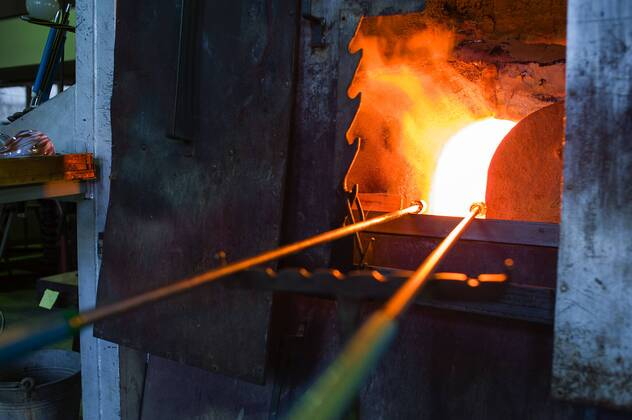
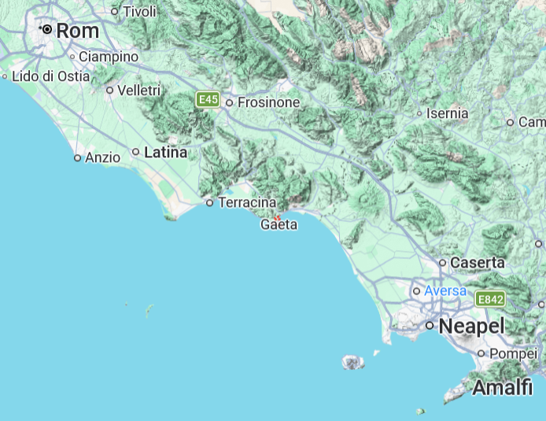
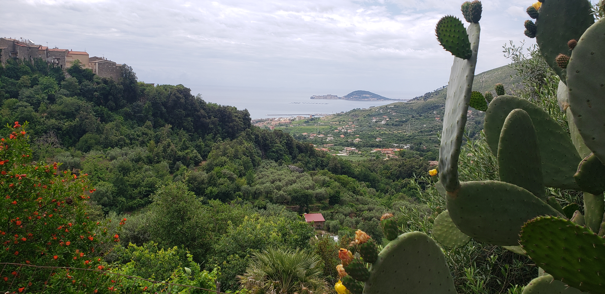
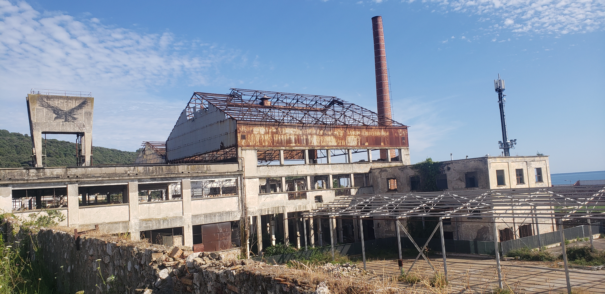
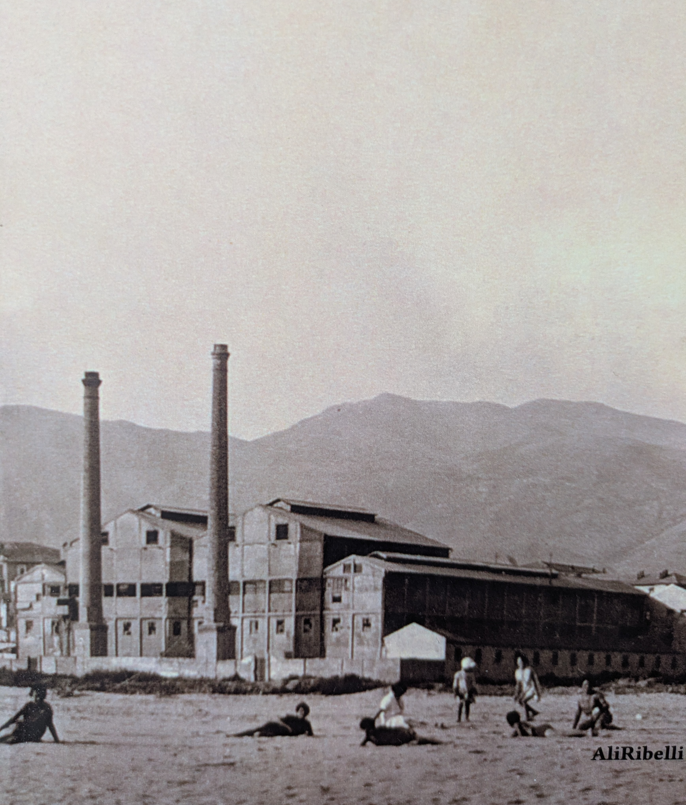
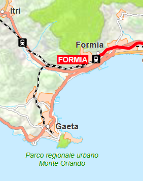
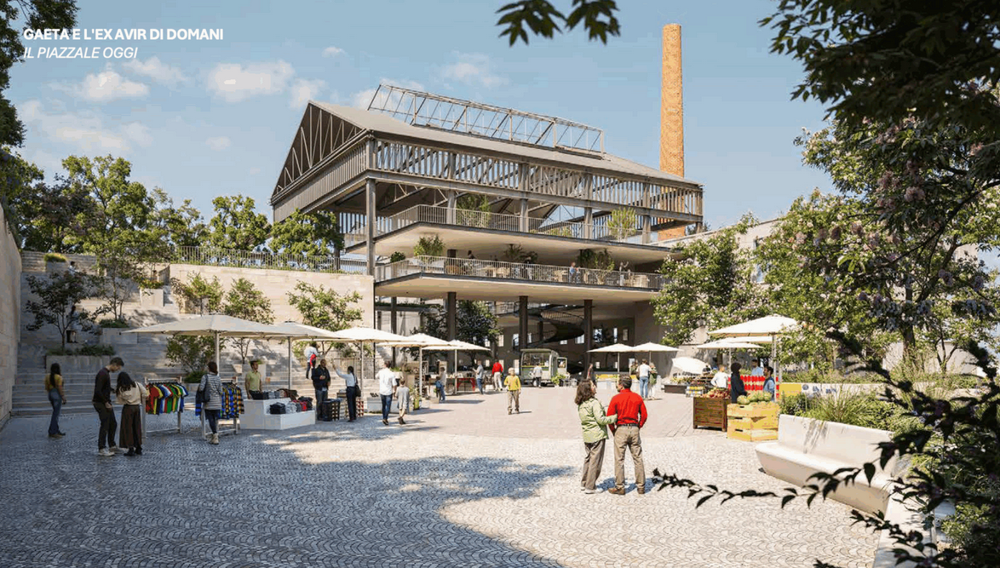

 

Etwa 150 Kilometer südlich von Rom liegt das malerische Küstenstädtchen Gaeta, das man von Italiens Hauptstadt mit dem Regionalzug in Richtung Neapel erreicht. Der Ort ist heute vom Tourismus geprägt. Viele Einheimische kommen aus den nahegelegenen Großstädten Rom und Neapel, die noch vor den internationalen Touristen den größten Teil ausmachen. Wenn man das Städtchen bereist, wird jedoch schnell klar, dass Gaeta noch eine andere Geschichte zu erzählen vermag --- jene eines längst vergangenen industriellen Zeitalters.

 

Bis 1982 gab es in Gaeta einen Bahnhof. Seitdem dieser jedoch stillgelegt wurde, müssen Reisende in Formia umsteigen, um von dort mit dem Bus ein paar Kilometer weiter nach Gaeta zu gelangen. Der Küstenort besteht aus einem modernen Teil, den man aus Formia kommend zuerst erreicht, und einer pittoresken historischen Altstadt, die auf einer hoch über das Meer ragenden Seezunge liegt. Monte Orlando heißt der Berg, der sich auf der Landzunge erhebt und den alten, etwas verschlafen wirkenden Stadtkern vom modernen und wesentlich lebhafteren Stadtteil trennt. Hier befinden sich zahlreiche Boutiquen, Bars und Restaurants sowie der weitläufige Strand "Serapo".

 

Beim Spazieren auf dem weichen Strand von Serapo, an dessen Ufer das Tyrrhenische Meer ruhig vor sich hin plätschert, fällt nach nur wenigen Metern ein großer, aus Backstein gemauerter Schornstein auf, der aus dem angrenzenden modernen Stadtteil Gaetas herausragt. Der Schornstein passt nicht in das sonst eher touristische Bild der Stadt.
Es sind nur wenige Schritte, um vom Strand an eine etwa 200 Meter lange Begrenzungsmauer einer stillgelegten Industrieanlage zu gelangen, aus welcher sich der Schornstein emporhebt. Von der hinteren Seite des Areals, weiter stadteinwärts, kann man das Gelände gut überblicken. Neben dem Schornstein besteht die stillgelegte Anlage aus einem Fundament aus Zement sowie einem Stahlgerüst, das dem Dach des Gebäudes seine Struktur verleiht, dessen sonstige Bestandteile der Zeit aber wohl nicht standgehalten haben. 

 

Die Anlage wirkt wie eine Filmkulisse, die eine Geschichte aus einer anderen Zeit erzählen sollte. Aber welche? Dass es sich um eine ehemalige Fabrik handelte, ist beim ersten Anblick eine offensichtliche Vermutung, doch um welche Industrie könnte es sich gehandelt haben, und warum würde das Gebäude nach so vielen Jahren immer noch in einem so erbärmlichen Zustand zu sehen sein? Das Fabrikgelände liegt unmittelbar am Strand, der Standort hätte also längst lukrativer genutzt werden können.

Bei der Suche nach Anhaltspunkten erzählte die Kassiererin eines nahegelegenen Supermarktes, dass das alte Fabrikgebäude früher eine Glaserei gewesen sei, die aber schon vor vielen Jahren geschlossen wurde. Viel mehr konnte die freundliche Frau darüber nicht berichten. Auch der Verkäufer eines im Zentrum gelegenen Buchladens versicherte, dass sein Bestand nichts über die Geschichte der alten Fabrik beinhalte. Es gäbe jedoch, so der Verkäufer, eine Art Tagebuch über die Glaserei, mit vielen Fotos und Beschreibungen über die Geschichte der Fabrik, und verwies auf die zahlreichen Zeitungsstände in der Stadt, die hin und wieder auch solche Art von Büchern in ihrem Sortiment hätten. Das Tagebuch gab es tatsächlich. Einer der vielen Kioskbetreiber kramte mehrere Minuten in seinem Bestand aus historischen und aktuellen Zeitschriften, bis er das kleine Buch fand, auf dessen Umschlag ein altes Foto der Glaserei zu sehen ist, als sie noch in Betrieb war --- damals noch mit zwei Schornsteinen.^[Langella, Alfredo. *La vetreria di Gaeta --- Diario storico-fotografico*. A cura di Jason R. Forbus, Ali Ribelli Edizioni, Gaeta, 2020.] 

 

Die stillgelegte Glaserei von Gaeta, so erzählt das Tagebuch, wurde einst im Jahr 1909 von Cesare Ricchiardi, der bereits weitere ähnliche Betriebe in Livorno (Toskana), Sesto und Asti (Piemont) besaß, als Genossenschaft gegründet. Zwei Jahre dauerte der Bau der Anlage, sodass im Juni 1911 die Produktion aufgenommen wurde. Der Standort war ideal: Der Strand Serapo ermöglichte eine schier unendliche Provision des Grundmaterials für die Produktion von Glasprodukten. Ricchiardi investierte schnell in neue Produktionstechnologien, um den Standort bestmöglich zu nutzen. So wurden schon einige Jahre nach dem Aufbau der Produktionsstätte die damals genutzten sogenannten Hafenöfen nach und nach durch Wannenöfen ersetzt. Hafenöfen bestehen aus zylinderförmigen Behältnissen (Hafen), in welchen die Glasmasse eingeschmolzen wird. Nachdem dieser Vorgang abgeschlossen ist, wird das flüssige Glas zur Weiterverarbeitung entnommen, um den Hafen von Neuem zu füllen. Im Gegensatz dazu erfolgt der Schmelzprozess in Wannenöfen fortlaufend, da auf der einen Seite des Ofens die Rohmaterialien zugeführt werden und auf der anderen Seite das flüssige Glas zur Weiterverarbeitung direkt wieder abgeführt werden kann. Die Umstellung auf Wannenöfen bedeutete einen enormen Produktivitätsgewinn für die Glaserei, was darüber hinaus damit einherging, dass nun über alle Tagesschichten hinweg produziert werden konnte, wodurch die Anzahl der Mitarbeiter stieg. Schon 1916 zählte der Betrieb 150 Beschäftigte, wovon sechs Frauen waren sowie 30 Knaben unter 15 Jahren. Im Jahr 1924 wurde die ursprüngliche Genossenschaft in eine Aktiengesellschaft umgewandelt, um gesetzliche Schwierigkeiten mit dem damaligen faschistischen Regime zu vermeiden. In diesen Jahren stieg die Nachfrage nach den produzierten Glaswaren stetig. Mehrere Kapitalerhöhungen erlaubten es, nicht nur die Kapazität zu steigern, sondern auch die Produktpalette zu erweitern: Um 1926 verdienten bereits etwa 300 Menschen ihr Geld bei der Glaserei, die neben 25-Zentiliter-Flaschen auch Korbflaschen mit einem Fassungsvermögen von bis zu 70 Litern herstellte. Die Abnehmer der hergestellten Glaswaren waren Getränkehersteller, etwa von Mineralwasser, Milch oder Wein, vor allem aus den nahegelegenen Städten Rom und Neapel. 

Doch war diese Phase des ökonomischen Erfolgs nicht frei von schwierigen Momenten. Um die Öfen auf bis zu 1500 °C zu erhitzen, wurden sie mit Kohle befeuert, welche aus England bezogen wurde. Als die englischen Minenarbeiter für einige Monate streikten, konnte die Glaserei während dieser Zeit nicht mit Kohle beliefert werden, was mit einem Produktionsstopp und damit verbundenen herben Verlusten einherging. Einige Jahre später, zu Beginn des Zweiten Weltkrieges, wurde die Produktion zunächst aufrechterhalten, doch während der deutschen Besatzung gingen viele der Glasarbeiter in andere Regionen Italiens, um sich in Sicherheit zu bringen. Im November 1943 verminten die Nazis den Strand von Serapo, um sich vor der drohenden Ankunft der Alliierten zu wappnen. Darüber hinaus zerstörten sie kurz vor deren Ankunft große Teile der Fabrikanlage ebenso wie den für die lokale Infrastruktur so wichtigen Bahnhof von Gaeta. Nach der Befreiung der kleinen Küstenstadt im Mai 1945 kehrten viele Glasarbeiter, die sich während der Besatzung vor allem in der Toskana und in Kampanien aufhielten, wieder zurück. Sie waren es, die maßgeblich dazu beitrugen, dass die stark beschädigte Fabrik wieder zügig aufgebaut wurde, sodass dort bereits 1948 wieder 300 Arbeiter beschäftigt waren, die monatlich an die 550.000 Flaschen und Flaschenkörbe produzierten. Erst 1954 wurde der neu errichtete Bahnhof Gaetas eingeweiht, nun aber mit einem eigens für die Glaserei angelegten Schienenzugang, um den Abtransport der Glasprodukte effizienter zu gestalten. Die Glaserei wurde weiter automatisiert, beispielsweise im Jahr 1964, durch die Einführung der Doppeltropfenverarbeitung, bei der das geschmolzene Glas in zwei kleine Portionen, die als Glastropfen bezeichnet werden, geschnitten wird, welche im anschließenden Prozess zu Flaschen weiterverarbeitet werden. Im Jahr 1974 wurden somit täglich bis zu 730.000 Flaschen unterschiedlicher Formate produziert, was monatlich einem Volumen von elf Millionen Flaschen entsprach. Zu diesem Zeitpunkt arbeiteten in der Glaserei noch an die 240 Menschen, also gut 60 Arbeiter weniger als noch 1945. Seit seiner Gründung bis Mitte der 70er Jahre konnte die Glaserei somit ihre Produktion und Produktivität stetig steigern.
Dass der Betrieb schon 1982 eingestellt wurde, erzählt einem das Tagebuch daher mehr als unerwartet.

Beim Anblick auf den Innenhof der alten Fabrik erwacht die Vorstellung, wie hier wohl die Arbeiterinnen und Arbeiter die Flaschen transportfähig gemacht haben, deren Klappern man dabei sicher bis weit über das Fabrikgelände gehört haben musste. Anschließend wurden sie zunächst zum Bahnhof nach Gaeta und von dort in Richtung Rom oder Neapel transportiert. Warum wurde die Glaserei so plötzlich geschlossen, wenn sie doch durchgehend ihre Kapazität erweiterte? Bei der Suche nach möglichen Gründen lässt sich schnell die Stilllegung des Bahnhofs ausmachen, welche der Schließung der Glaserei nur um ein Jahr vorausging. Als ein bis heute wichtiger Bahnhof besteht jener von Formia, der auf der Strecke zwischen Rom und Neapel liegt, der "direttissima", einer Verbindung, die bis heute von vielen Reisenden genutzt wird. Die sieben Kilometer lange Zugstrecke zwischen Formia und Gaeta wurde in der Nachkriegszeit immer weniger genutzt, was daran lag, dass das Auto mehr und mehr an Bedeutung gewann, den Schienenverkehr allmählich ablöste und somit die kurze Verbindung unwirtschaftlich machte.

 

Für den Gütertransport wurde die Strecke aber vor allem für die Glaserei zunächst noch erhalten, bis auch dieser 1981 eingestellt wurde. Die 240 Beschäftigten, die zu diesem Zeitpunkt noch in der Glaserei arbeiteten, und möglicherweise auch der Eigentümer Ricchiardi selbst unternahmen mit Sicherheit alles in ihrer Macht Stehende, um die Gemeinde und die Region davon zu überzeugen, die wenigen Schienenkilometer zwischen Gaeta und Formia zu erhalten, um die damit verbundenen Arbeitsplätze zu retten. Die Stilllegung des Bahnhofs konnte also nicht der einzige Grund für die letztliche Schließung der Fabrik gewesen sein.

Um sich der Antwort über die weiteren Gründe der Schließung der Glaserei zu nähern, ist ein erweiterter Blick nötig. In der Nachkriegszeit konnte nicht nur Deutschland, sondern auch Italien ein unglaubliches Wirtschaftswachstum verzeichnen. Alle Wirtschaftszweige profitierten davon, vor allem aber die verarbeitende Industrie, zu der auch der Sektor für die Herstellung von Glasprodukten gehört. Das Wirtschaftswachstum wurde zum einen durch eine steigende inländische Nachfrage getrieben, zum anderen wurde in den 50ern und 60ern der europäische Handel liberalisiert, was für eine höhere ausländische Nachfrage sorgte. Dies war für italienische Unternehmen jedoch ein zweischneidiges Schwert: Auf der einen Seite erleichterte es den Unternehmen durch die reduzierten Zollbarrieren den Zugang zu neuen Absatzmärkten, auf der anderen Seite waren sie so aber auch dem internationalen Wettbewerb, vor allem mit französischen und deutschen Unternehmen, ausgesetzt. Die italienische Wirtschaft wuchs während dieser zwei Dekaden ununterbrochen und mit ihr die heimische Glasindustrie. Im Jahr 1963, so analysierte der italienische Verband der Glasindustrie, stieg die Gesamtproduktion von italienischen Glasprodukten um bis zu 20 % im Vergleich zum Vorjahr.^[ASSOVETRO. *Una storia di vetro --- I 75 anni dell’Associazione Nazionale degli Industriali del Vetro 1947–2022*. A cura di Federica Cingolani, 2022.] Überstiegen im Jahr 1960 die Importe von Glasprodukten noch die Exporte, so drehte sich das Verhältnis im Jahr 1968 um, was sicher als ein starkes Signal in Bezug auf die Wettbewerbsfähigkeit der italienischen Glasindustrie zu bewerten war. 

Zugleich zeichneten sich jedoch strukturelle Probleme ab, die in den 70er Jahren immer deutlicher wurden. Italien hatte keinen direkten Zugang zu Rohstoffen für die Energiegewinnung, wodurch das Land abhängig von Preisschwankungen auf den internationalen Rohstoffmärkten für Öl und Kohle war --- ein Umstand, der schon in den Vorkriegsjahren deutlich wurde, als die Glaserei wegen der Lieferengpässe von Kohle aus England die Produktion einstellen musste. Speziell für energieintensive Industrieunternehmen, solche wie die Glaserei von Gaeta, hing die Wettbewerbsfähigkeit somit stark vom Zugang zu günstiger Energie und Rohstoffen ab. Die Ölpreiskrise von 1973 traf Italien und seine Industrien daher mit voller Wucht, was nach vielen Jahren des Wachstums dazu führte, dass die italienische Wirtschaft zum ersten Mal wieder schrumpfte. Darüber hinaus ist die italienische Unternehmenslandschaft jeher dadurch charakterisiert, dass es eine Vielzahl kleiner Unternehmen gab, welche im internationalen Wettbewerb oftmals Nachteile hatten, vor allem im Konkurrenzkampf mit Deutschland, wo der bekannte deutsche Mittelstand in vielen Branchen relativ große, dadurch auch effiziente und somit sehr konkurrenzfähige Unternehmen hervorbrachte. Ob dies ein entscheidender Grund für die Schließung der Glaserei von Gaeta war, lässt sich rückblickend nur vermuten.
Neben dem internationalen Wettbewerb und der Energiefrage sollte aber ein weiterer schwerwiegender Faktor hinzukommen, der ganz sicher auch für die Glaserei am Strand von Serapo problematisch sein würde: Im Laufe der 70er Jahre hielten Kunststoffprodukte Einzug in allerlei Bereiche --- wie auch in der Lebensmittelindustrie, in der Kunststoffflaschen für Getränke wie Wasser und Milch mehr und mehr genutzt wurden. Die Herstellung dieser Produkte war günstiger und die Behältnisse leichter und handlicher, wodurch sie ihren Marktanteil stetig erhöhen konnten. Der Versuch der italienischen Glashersteller, Hygienevorbehalte gegen das neue Verpackungsmaterial aufzubringen, um Konsumenten vom Kauf von Getränken in Glasflaschen zu überzeugen, könnte den Siegeszug der Kunststoffbehältnisse allerhöchstens etwas verlangsamen. \
Es scheint somit ganz so, als ob die Summe all dieser Aspekte für den erfolgreichen Fortbestand der Glaserei schlussendlich zu viel war, sodass auch die lokalen politischen Kräfte eine Stilllegung des Bahnhofs nicht vermeiden wollten, nur um den angeschlagenen Patienten der Stadt noch ein paar Jahre länger am Leben zu halten.

Abhängigkeiten in der Rohstoffbeschaffung zur Energiegewinnung, verstärkter internationaler Wettbewerb nicht nur in Bezug auf bestehenden Produktmärkten, sondern auch im Hinblick auf neu aufkommende Produkte, sowie strukturelle Nachteile im Vergleich zu anderen Ländern. All diese Faktoren haben einen Einfluss darauf gehabt, dass Italien und seine verarbeitenden und vor allem die bereits erwähnten energieintensiven Industrien wie die Glasindustrie im Laufe der 80er und 90er Jahre an Boden verloren haben.

Beim Blick auf die zerfallene Fabrikanlage verblasst die Vorstellung über die Arbeiter, die dabei waren, die Flaschen im Innenhof zu verladen, wieder. Obwohl das alles schon viele Jahrzehnte zurückliegt, klingen die damaligen Umstände, die zum Niedergang der Fabrik geführt haben, ganz aktuell. Wie Italien ist auch Deutschland abhängig von externen Rohstoffmärkten. War über Jahre die Provision von Rohstoffen wie Öl und Gas günstig und stabil, muss das Land heute aufgrund verschiedener geopolitischer Konflikte Engpässe hinnehmen, was mit gestiegenen Energiepreisen einhergeht. Dadurch sehen die für das Land so wichtigen Industriezweige wie die Automobil- und Maschinenbauindustrie ihre Wettbewerbsfähigkeit zunehmend in Gefahr. Gleichzeitig sieht sich die Automobilindustrie durch das Aufkommen von günstigen, elektrobasierten Kraftfahrzeugen von neuen internationalen Anbietern unter Wettbewerbsdruck, welche bisherige Produkte vom Markt verdrängen und somit das Geschäftsmodell der heimischen Produzenten infrage stellen. In immer kürzeren Abständen erscheinen Berichte über signifikante Gewinneinbrüche --- sowohl der großen Unternehmen als auch von deren Zulieferern, deren Geschäftstätigkeit ganz auf die großen Konzerne ausgerichtet ist. Nicht in wenigen Fällen wird nur kurze Zeit später von umfassenden Stellenstreichungen berichtet.

Die stillgelegte Glaserei von Gaeta gewährt einen Einblick in den industriellen Zerfall aus dieser Zeit und gleichzeitig hat sich um die Anlage eine ganz neue lokale Wirtschaft entwickelt. Der Grund, warum das Fabrikgebäude noch heute zu sehen ist, geht auf deren früheren Eigentümer zurück, die sich lange um die Besitzverhältnisse stritten. Erst im Jahr 2019 gingen der Grund und das Gebäude in den Besitz der Kommune Gaetas. Nun sollen Pläne zur Wiederbelebung des Areals umgesetzt werden, jedoch nicht für den ursprünglich industriellen Zweck, sondern um einen neuen Ort der Kultur zu schaffen.

 

Es gibt einige Beispiele für die Transformation von einstigen Industrieschauplätzen hin zu Kulturstätten. Eines der wohl eindrücklichsten in dieser Hinsicht ist die baskische Metropole Bilbao: Dort, wo früher ein wichtiger Umschlagsplatz für Stahlerzeugnisse war, steht heute das berühmte Guggenheim Museum für Moderne Kunst. Nach dem Rückgang des einst florierenden Bergbaus und der angegliederten Stahlindustrie hat sich die Stadt neu erfunden, was zu einer hohen Lebensqualität für die Menschen geführt hat. Gaeta könnte nun in etwas kleinerem Maßstab einen ähnlichen Weg gehen.

