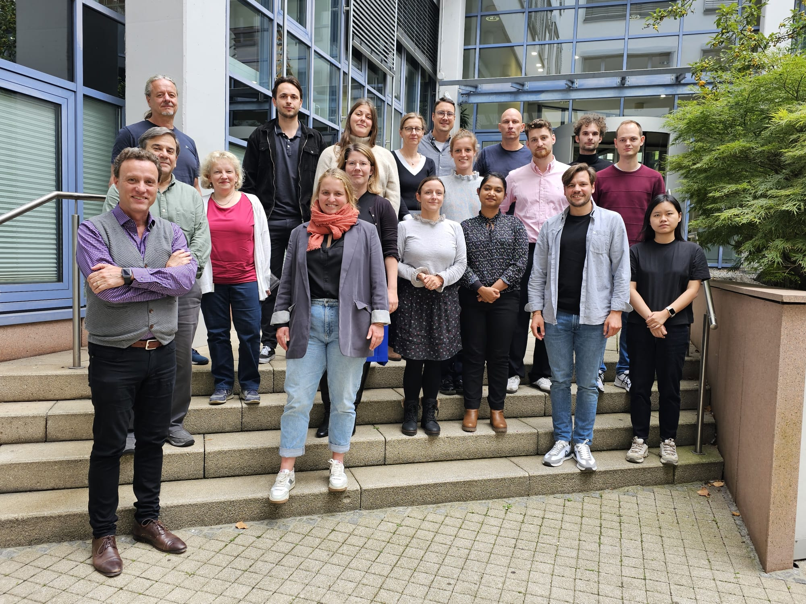

# High-growth entrepreneurship, innovation, and the transformation of the economy

## General information

**Funding and Principal Investigators (PIs) **

> This project will be realized as a cooperation between [IWH - Halle Institute for Economic Research](https://www.iwh-halle.de/en/) and [ZEW - Leibniz Centre for European Economic Research](https://www.zew.de/en/).
>
> The project is funded by the [Leibniz Association](https://www.leibniz-gemeinschaft.de/en/), by obtaining the [Leibniz Collaborative Excellence](https://www.leibniz-gemeinschaft.de/en/research/leibniz-competition/leibniz-collaborative-excellence) fund as part of the [Leibniz Competition](https://www.leibniz-gemeinschaft.de/en/research/leibniz-competition), which comprises for both institutes 1 Mio. Euro over three years (2024-2026).
>
> **Project lead/speakers**
>
> -   Enrico De Monte
>
> -   Javier Miranda
>
> **PIs**
>
> -   Prof. Dr. Ufuk Akcigit, University of Chicago,
>
> -   Dr. Andre Diegmann, IWH and IAB
>
> -   Prof. Dr. Karin Hoisl, University of Mannheim,
>
> -   Prof. Dr. Hanna Hottenrott, ZEW and Technical University Munich
>
> -   Prof. Dr. Javier Miranda, IWH and Friedrich-Schiller University Jena
>
> -   Dr. Enrico De Monte, ZEW
>
> -   Prof. Dr. Merih Sevilir, IWH and ESMT-Berlin

**Short summary**

> Transformative innovation is fundamentally disruptive leading to reallocation, productivity growth, and growing standards of living. Entrepreneurial firms are believed to be at the heart of this process by introducing new ideas, products, and services that displace those offered by less innovative firms. This creative-destruction process underlies business dynamism in modern market economies. However, entrepreneurship and business dynamism are in decline in the US and Europe with potentially broad implications for innovation, productivity growth, and well-being. The arising key question is what can be done to achieve sustainable competitiveness. We propose a program to study the conditions, determinants, and implications of innovative high-growth entrepreneurship in Germany. We bring together a leading group of national and international experts in a partnership between IWH and ZEW and develop a rich new data infrastructure to study high-growth entrepreneurship.
>
> The work program consists of three work packages (WP). The first one develops the microdata infrastructure necessary to study entrepreneurship and business dynamism in Germany. In particular, we bring together detailed information of firms, establishments, founders, workers, and inventions. The second WP aims to shed light on high-growth firm activity and its relation to innovation. We pay special attention to: i) who creates high-growth firms looking at the role of entrepreneurial traits; and ii) who works at high growth firms looking at the role of workforce skill and shortages. The third WP investigates the role of the competitive environment and the role of acquisitions. The output of this project will be threefold: First, new insights with high relevance for policymakers in Germany and beyond. Second, a new and lasting data infrastructure that will allow high-quality research and policy advice. Third, this project will strengthen the relations and collaboration between the Leibniz institutes IWH and ZEW.

## News Blog

>**September, 25th 2024.**
> Kick-off workshop at ZEW in Mannheim. About 20 researchers from ZEW, IWH, and IAB came together to officially kick off our project. While this was the first meeting in person, a lot of work in terms of building a new data infrastructure has already been done. The workshop allowed us to discuss the progress of the project as well as future objectives. Mark Roberts, as a scientific advisor of the project, shared his valuable views and suggestions with us to improve our work on the data towards the related research. Soon more!  
>
>
> Thorsten Doherr, Leon Steines, Lena Füner, Sandra Gottschalk, Martin Friedrich, André Diegmann, Alexander Reifschneider, Lion Holste, Jakob Ehlich,  Eline Schoonjans, Mark Roberts, Bettina Peters, Simona Murmann, Hanna Hottenrott, Afroza Alam, Enrico De Monte, Jiamin Wang, and Javier Miranda. (Not all team members are on the picture). 

>**June, 1st 2024.**
> Official start of the project. 

> **September, 22nd 2023.**
> Winning the Leibniz Competition Fund for the 3-year research project "High Growth Entrepreneurship, Innovation, and the Transformation of the Economy.

> **May, 30th 2023.**
> Submission of research proposal to the Leibniz Association for participating in the Leibniz Competition.
