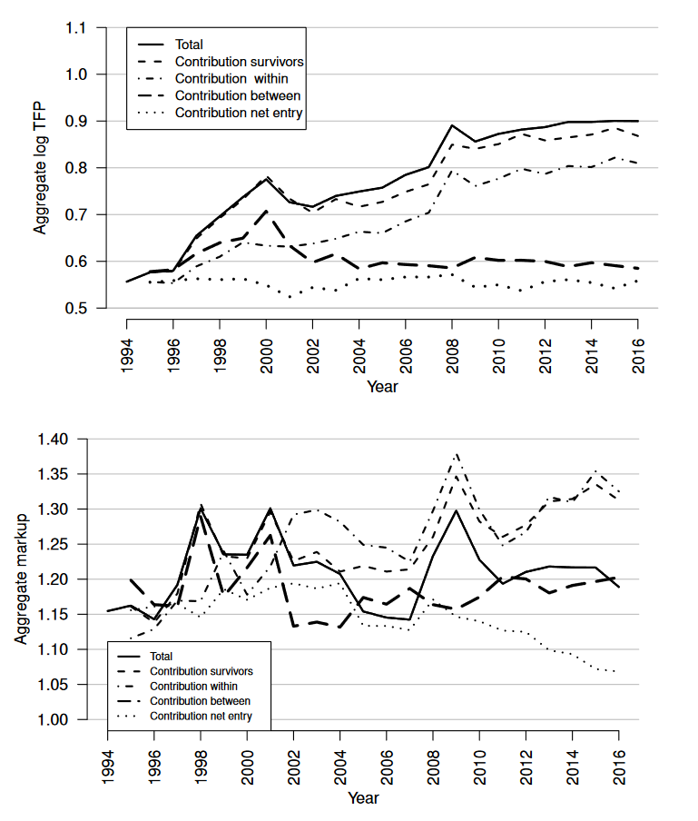
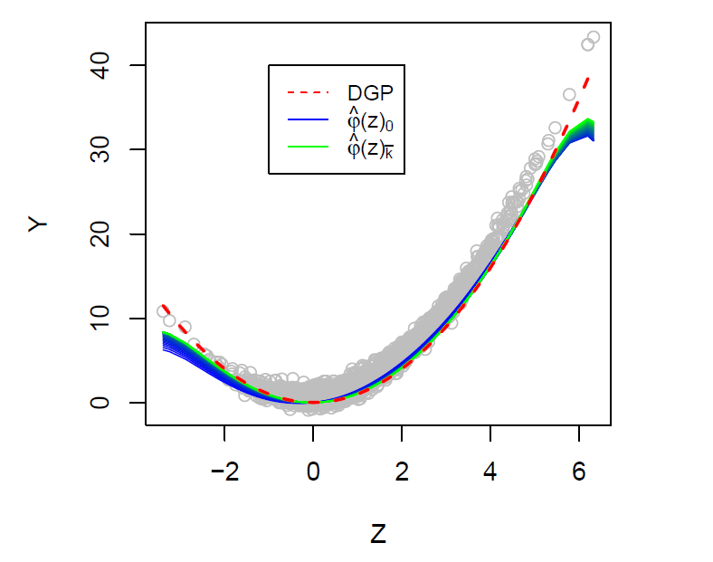
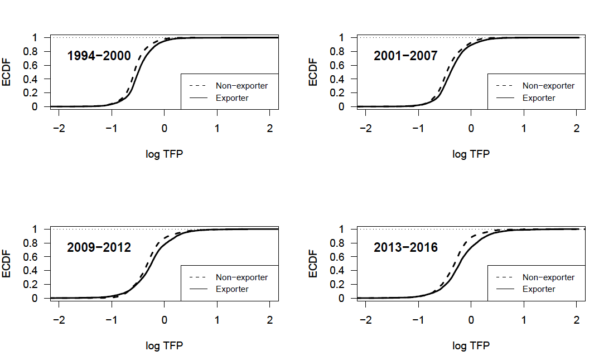
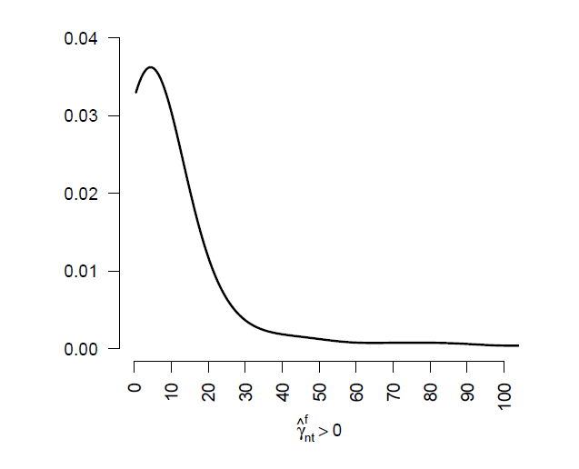
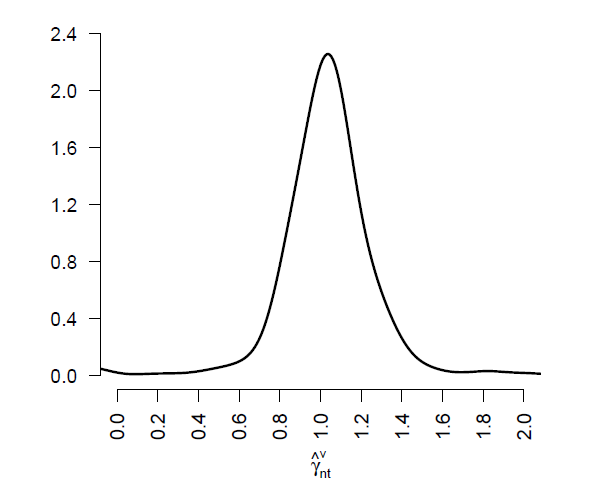

# Peer-reviewed publications

[Productivity, markups, and reallocation: Evidence from French manufacturing firms](https://link.springer.com/article/10.1007/s00181-026-02929-y), 2026, *Empirical Economics* 70(6), 88.
 \[[Working Paper version](https://www.zew.de/publikationen/productivity-markups-and-reallocation-evidence-from-french-manufacturing-firms-from-1994-to-2016)\] \[[Online Appendix](Documents/De Monte_2026_Online_Appendix.pdf)\]

More

> This paper investigates the evolution of aggregate productivity and markups among French manufacturing firms between 1994 and 2016, by focusing on the role of reallocation with respect to both aggregate measures. Firm-level productivity and markups are estimated based on a gross output translog production function using popular estimation methods.

::: columns
::: {.column width="50%"}

:::

::: {.column width="50%"}
> As the figures show, I find an aggregate productivity growth of about 34% over the whole period while aggregate markups are found to remain relatively stable (see the solid lines in both figures). As a key finding the study further shows that over time reallocation of sales shares affects differently aggregate productivity and markups (long-dashed line): Before 2000 both aggregate productivity and markups are importantly driven by reallocation effects; Post-2000, instead, the contribution of reallocation to aggregate productivity becomes negligible, inducing a slowdown in aggregate productivity growth, while I measure persistent reallocation of sales shares from lower to higher markup firms. Policy relevant implications of these dynamics are discussed.
:::
:::

[Nonparametric instrumental regression with two-way fixed effects](https://www.degruyter.com/document/doi/10.1515/jem-2022-0025/html), 2023, *Journal of Econometric Methods*, 13(1), 49-66. \[[Code](https://enricodemonte.github.io/code.html)\]

More

> This paper presents a novel nonparametric instrumental estimator while controlling for unobserved additive fixed effects. In particular, I consider a model such as
>
> $$
> Y_{it} = \varphi(Z_{it}) + \xi_{i} + \delta_t + U_{it}, 
> $$
>
> where $Z_{it}$ is supposed to be correlated with both the unobserved individual and temporal effects, $\xi_i$ and $\delta_t$, and with the the error term $U_{it}$. Such settings are typical when estimating market equilibrium models as, for instance, product demand or supply, where $Y_{it}$ and $Z_{it}$ might represent output prices and quantity and $\xi_i$ and $\delta_t$ unit and time specific shocks. To consistently estimate the nonparametric conditional mean function $\varphi$ one has to control for the simultaneity bias, occurring when prices and output quantity are jointly determined, as well as for the unobserved fixed effects. For that purpose, I combine the Landweber-Fridman regularization for the IV-part with a locally-weighted nonparametric fixed effects estimator. A Monte Carlo simulation reveals good finite sample behavior of the novel estimator and confidence intervals are provided by the application of the wild residual block bootstrap.

::: columns
::: {.column width="40%"}
> The figure shows the regularized solution path of the nonparametric instrumental estimator while controling for two-way fixed effects. The estimator is applied on simulated data where the conditional mean function $\varphi$ is consistently estimated after 44 iterations, depicted by the green line.
:::

::: {.column width="60%"}

:::
:::

[Productivity dynamics and exports in the French forest product industry](https://www.nowpublishers.com/article/Details/JFE-0540). 2022, *Journal of Forest Economics*, 37(1), 1-71. \[[Working paper version](Documents/WP_Forest%20Product%20Industry_2022_De%20Monte.pdf)\]

More

> This paper investigates aggregate productivity dynamics of the French forest product industry based on firm-level data from 1994 to 2016. The main objectives of the paper are to investigate aggregate productivity growth in the industry, while taking market entry and exit into account. Further, aggregate productivity growth is investigated with respect to firms' export status and with respect to their domestic and export economic activity. Decomposing the productivity growth into the contribution of incumbent, entering, and exiting firms, the results show a considerable slowdown during the economic crisis from 2007 on, which is mainly induced by decreasing productivity improvements and inefficient resource allocation among incumbent firms. Moreover, the study shows that exporters contribute more to aggregate productivity growth than non-exporters. However, investigating the contribution of firms' domestic and export economic activities on aggregate productivity growth, I find that the aggregate productivity growth is mainly related to firms' domestic economic activity.

::: columns
::: {.column width="70%"}

:::

::: {.column width="30%"}
> The figure shows the empirical cumulative distribution function (ECDF) of exporting and non-exporting firms' productivity. For all periods exporters of the French forest product industry reveal higher productivity compared to non-exporting firms.
:::
:::

# Working papers

[Imperfect competition with heterogenous firms, welfare and misallocation](Documents/De Monte_Koebel_2026.pdf) (with [B. Koebel](https://beta-economics.fr/annuaire/54/koebel_bertrand/)) \[[Online Appendix](Documents/De Monte_Koebel_2026_Online Appendix.pdf)\]

More

>This paper characterizes the short- and long-run Cournot equilibrium with heterogeneous firms and stochastic technological change. In our model, firms have different technologies with heterogeneous fixed and variable costs and various degrees of markups. In a framework with homogeneous firms, Mankiw and Whinston (1986)  show that the long-run Cournot equilibrium may be inefficient due to too many entries. We extend their result to the case of heterogeneous firms and show that higher industrial concentration of production is welfare improving. Using administrative data for French manufacturing firms, we estimate a wide degree of unobserved heterogeneity in both fixed and variable costs. Our simulation exercise shows that markups surprisingly only induce slight inefficiencies in the allocation of output, implying that it is almost compatible with welfare maximisation. Instead, firms’ choice to employ heterogeneous and often inefficient technologies turns out to harm substantially welfare and aggregate output. In the paper we also consider an extended version of the Cournot model with conjectural variations and also compatible with product differentiation.

::: columns
::: {.column width="40%"}

> A simpliefied version of the cost function employed in our model is given by
>
$$
c_n = \textcolor{red}{\gamma^f_n} f(w_n) + \textcolor{red}{\gamma^v_n} v(w_n) y_n + \epsilon_n,   
$$
>where $c_n$ denotes total costs of a firm $n$, $\textcolor{red}{\gamma^f_n}$ and $\textcolor{red}{\gamma^f_n}$ denote unobserved cost efficiency parameters associated with the fixed and variable cost component, denoted by $f(w_n)$ and $v(w_n)$, respectively. $w_n$ represents a vector of input prices, $y_n$ a firm n's production level, and $\epsilon_n$ an error term.
>
>One important contribution of the paper is a method allowing us to estimate the endogenous cost efficiency parameters of both fixed and variables costs. 
As a result, the figure on the right shows the kernel density estimates of the distribution of $\textcolor{red}{\widehat{\gamma}^f_n}$ (upper plot) and $\textcolor{red}{\widehat{\gamma}^v_n}$ (lower plot). Both densities are single peaked, and show that there is a high probability mass around $\gamma^f=0$ and around $\gamma^v=1$. 
>
> Further results presented in the paper show that fixed and variable costs are inversaly related: larger firms have higher fixed costs and lower marginal costs. 
:::

::: {.column width="60%"}

:::
:::

> We then use parameter estimates of the empirical cost and demand function to simulate under which conditions welfare is maximized both in the short- and in the long-run. 

# Work in progress

Business dynamism and high-growth firms in Germany (with [S. Gottschalk](https://www.zew.de/team/sgo), [J. Miranda](https://www.iwh-halle.de/en/about-the-iwh/team/detail/javier-miranda/), and [S. Murmann](https://www.zew.de/team/scw))

Nonparametric shape constrained estimation of panel data models with endogenous variables

# Policy advice and technical reports

[Masterplan for small- and middle-sized businesses, 2024](https://www.baden-wuerttemberg.de/fileadmin/redaktion/m-wm/intern/Publikationen/MasterplanMittelstand_final_18.10.2024.pdf), on behalf of the Ministry of Economics, Labor, and Tourism of the Federal State Baden-Württemberg (with researchers from ZEW, imf (Mannheim) and IAW (Tübingen)). 

[Business dynamics in knowledge-intensive industries in Germany 2023](https://www.e-fi.de/fileadmin/Assets/Studien/2025/StuDIS_02_2025_.pdf) - Studien
zum deutschen Innovationssystem, on behalf of the German Commission of Ex-
perts for Research and Innovation -EFI, 2025 (with [J. Ehlich](https://www.zew.de/team/jel) and [S. Gottschalk](https://www.zew.de/team/sgo).

[Ex-ante analysis of the German start-up subsidy Programm "INVEST"](https://www.zew.de/publikationen/ex-ante-analyse-zum-foerderprogramm-invest-zuschuss-fuer-wagniskapital) (with various ZEW researchers and Technopolis Deutschland GmbH, on behalf of the German Federal Ministry of Economic Affairs and Climate Action, 2022)

[The effect of the German minimum wage on conditions of competition](https://www.zew.de/en/press/latest-press-releases/minimum-wage-had-only-little-impact-on-competitive-conditions) (with [A. Kann](https://www.zew.de/team/akn), M. [Lubczyk](https://sites.google.com/view/moritzlubczyk/) and [S. Murmann](https://www.zew.de/team/scw), on behalf of the German minimum wage commission, 2022)

-   Media coverage: [Tagesschau](https://www.tagesschau.de/wirtschaft/unternehmen/mindestlohn-studie-folgen-produktivitaet-zew-bundesregierung-arbeitslosigkeit-jobkiller-101.html), [Süddeutsche Zeitung](https://www.sueddeutsche.de/wirtschaft/arbeitsmarkt-mindestlohn-hat-kaum-negative-folgen-fuer-firmen-dpa.urn-newsml-dpa-com-20090101-220805-99-281869)

[Industry and productivity dynamics in Germany](https://www.bertelsmann-stiftung.de/de/publikationen/publikation/did/industry-and-productivity-dynamics-in-germany-all) (with J. Bersch, [N. Hahn](https://www.nadinehahn.com/), and G. Licht, ZEW research project for the Bertelsmann Stiftung, 2021)

-   Media coverage: [Frankfurter Allgemeine Zeitung](https://www.faz.net/aktuell/wirtschaft/studie-lowtech-unternehmen-treiben-die-produktivitaet-17535152.html)

# Book chapters

Unternehmen als Gestalter der Transformation. Aus Zuversicht Wirklichkeit
machen: Gedanken zum Zusammenhalt in Zeiten des Umbruchs, 2024, Kretschmann,
Winfried (Ed.), Chapter 4, 197-206, Herder, Freiburg. (with [H. Hottenrott](https://www.zew.de/en/team/hho))

Dynamisierung der Wirtschaft: Eine Herausforderung für die Industriepolitik, Deutsch-Französisches Institut (dfi), Frankreich Jahrbuch 2022 - [Politik der Zeitenwende? Europa im Umbruch, Frankreich Jahrbuch, Bd. 36 , Nomos Verlagsgesellschaft 69-88](https://www.nomos-elibrary.de/10.5771/9783748937142/frankreich-jahrbuch-2022) (with G. Licht)
